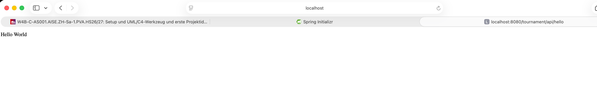

# Protokoll – KI-Coding, UML/C4 und erste Projektidee

> **Name:** Ho, Thanh Long
> **Datum:** 28.08.2026
> **Modul/Kurs:** AI-Assisted SWE

---

## a) KI-Coding-Werkzeug + lauffähiges «Hello World»

### 1. Verwendetes KI-Coding-Werkzeug

**Werkzeug:**  IntelliJ mit Claude CLI  
**Verwendeter Stack:** Spring Boot Backend, React Frontend

**Kurze Setup-Notiz:**  
Spring initializer

### 2. «Hello World»

**Beschreibung:**  
Ein einfacher Web-Endpunkt unter `/hello`, der `Hello World` zurückgibt


**Screenshot / Beleg:**  


### 3. Autocompletion vs. Code-Generierung

**Ein-Satz-Notiz:**  
Da das Projekt noch wenig Features hat wurde alles von Hand geschrieben. Das Projekt wurde mit Spring Init erstellt (autocompletion)
---

## b) UML/C4-Werkzeug

### 4. Verwendetes Diagramm-Werkzeug

**Werkzeug:** Mermaid Plugin in IntelliJ
**Integration:** IntelliJ-Plugin

**Kurze Setup-Notiz:**  
Das Projekt wurde mit Spring Init erstellt.

### Triviales C4-Container-Diagramm

**Diagramm-Code:**  
```text
[PlantUML- oder Mermaid-Code hier einfügen]
```

**Screenshot / Beleg:**  


---

## c) Erste Projektidee

## Vision

Die Planung und Durchführung von Turnieren soll für Organisationsteams möglichst einfach und effizient gestaltet werden, während Teams und Zuschauer:innen jederzeit einen klaren Überblick über den aktuellen Spielplan erhalten.

## Stakeholder

* **Turnier-Organisationsteam:** Möchte ein Turnier mit möglichst wenig manuellem Aufwand planen und bei kurzfristigen Änderungen schnell reagieren können.
* **Teilnehmende Teams:** Möchten jederzeit wissen, wann und auf welchem Feld sie spielen und gegen welches Team sie antreten.
* **Zuschauer:innen:** Möchten schnell sehen können, wann und wo ein bestimmtes Team spielt.

## Kernfunktionen

1. **Teams verwalten:** Das Organisationsteam kann Teams hinzufügen, bearbeiten und löschen sowie relevante Informationen zu den Teams erfassen.

2. **Spielfelder und Rahmenbedingungen verwalten:** Verfügbare Felder, Spielzeiten, Pausen und weitere organisatorische Rahmenbedingungen können erfasst und angepasst werden.

3. **Spielplan generieren:** Auf Basis der erfassten Teams, Felder und Zeitfenster wird regelbasiert ein gültiger Turnierplan erstellt.

4. **KI-gestützte Anpassung bei Änderungen:** Falls beispielsweise ein Team kurzfristig ausfällt, ein Spielfeld nicht verfügbar ist oder sich andere Rahmenbedingungen ändern, schlägt die KI alternative Spielplanvarianten vor, die möglichst wenige bestehende Spiele verändern und weiterhin die definierten Turnierregeln einhalten.

5. **Spielplan anzeigen:** Organisationsteam, teilnehmende Teams und Zuschauer:innen können den aktuellen Spielplan übersichtlich nach Team, Zeit oder Spielfeld einsehen.

## Kurz-Selbstprüfung

* **Fachliche Substanz – erfüllt:** Das Projekt umfasst die Planung und Verwaltung eines Turniers mit verschiedenen Abhängigkeiten wie Teams, Spielfeldern, Zeitfenstern und kurzfristigen Änderungen. Gruppenphasen, K.O. Runden, Rangierungspiele.

* **Frontend / Services / Persistenz – erfüllt:** Ein Frontend wird zur Verwaltung und Anzeige des Turniers benötigt, Services übernehmen die Spielplanlogik und die KI-gestützte Anpassung, während Teams, Felder und Spielpläne persistent gespeichert werden.

* **Substanzielle KI-Funktion – erfüllt:** Die KI übernimmt mit der Anpassung bestehender Spielpläne bei unerwarteten Änderungen eine zentrale Problemlösungsfunktion und schlägt unter mehreren Randbedingungen geeignete Alternativen vor.

* **Realistischer Umfang – erfüllt:** Der Umfang bleibt realistisch, da die initiale Spielplangenerierung regelbasiert erfolgt und der KI-Einsatz gezielt auf die Anpassung bestehender Spielpläne bei Änderungen beschränkt ist.


### Kurz-Selbstprüfung gegen die Auswahlkriterien

**Fachliche Substanz:**  
Erfüllt, weil es sich um ein reales Problem handelt. Viele Organisationen planen ihre Turniere noch manuell und sind bei kurzfristige Änderungen oft überfordert.

**Rechtfertigung für Frontend / Services / Persistenz:**  
React als Frontend-Stack erfüllt, da es sich um ein mittel-grosses Projekt handelt.
Spring Boot als Backend-Stack erfüllt, da es sehr stabil ist und Boilerplate Code vermindert.
Persistenz ist noch offen, wahrscheinlich PostgresDB, da es gut mit Heroku deployen lässt.

**Mindestens eine substanzielle KI-Funktion als Teil der Lösung:**  
KI sollte bei unvorhersehbare Planänderungen, Vorschläge für neue Spielplanung geben.
(noch offen)

**Realistischer Umfang:**  
Offen, weil eine klare Abgrenzung gemacht werden muss
