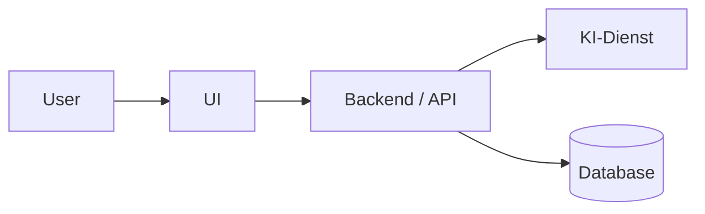
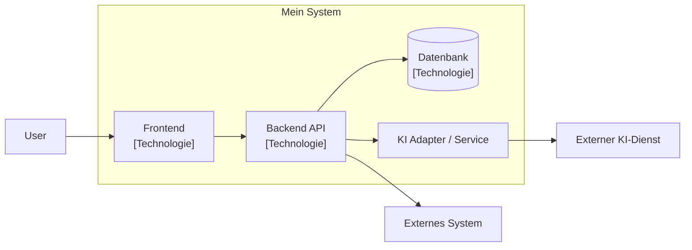

# Projektarbeit – Block 1

**Name:** Thanh Long Ho
**Projekt:** Tournetty
**Git-Repository:** https://github.com/thnhlng/tournetty-webapp
**Version:** 0.1
**Datum:** 3. September 2026

---

# 1. Problem- und Lösungsskizze

## 1.1 Ausgangslage / Problem

Plausch Volleyball-Turniere organisieren ihre Turniere oft noch manuell, welches sehr zeitaufwändig und unflexibel ist.
Die neue Webapp soll das Organisieren von Turnieren vereinfachen und automatisieren.

**Problem in 2–4 Sätzen:**
Turnier-Organisationen stehen vor grosse Herausforderungen, wenn ein Team kurz vor dem Turnierbeginn nicht auftaucht.
So sind Spielfelder leer und das Turnier verlängert sich künstlich.
Allgemein die Turnierplanung an sich ist eine grosse Herausforderung, da viele Regeln auf einmal angewendet werden müssen.

## 1.2 Vision

> **Vision:** Turniermanagement effizient und ohne Kopfschmerzen.

Beispielstruktur:

> Das System soll das Organisationsteam dabei unterstützen, Turnierplanung effizienter, sicherer oder zuverlässiger zu lösen.

## 1.3 Stakeholder

| Stakeholder       | Kerninteresse                           |
|-------------------|-----------------------------------------|
| Organisationsteam | Einfache und effiziente Turnierplanung  |
| Teilnehmer        | Übersicht vom Turnier (nächstest Spiel) |

## 1.4 Kernfunktionen

### Kernfunktion 1: Spielplan erstellen

**Beschreibung:**
Das System generiert den Spielplan für das Turnier.


**KI-Nutzen:**
Bei unvorhersehbare Abmeldungen oder Nichterscheinen eines Teams, werden die Felder nicht mehr komplett ausgelastet.
Dabei soll KI ein neuer Spielplan generieren können.

---

### Kernfunktion 2: Phase Generierung

**Beschreibung:**
Das System ermöglicht dem User die Phase des Turniers zu gestalten, spricht Gruppenphase sowie K.O. Phase mit oder ohne Rückspiele.

---

### Kernfunktion 3: Punktensystem Tracking

**Beschreibung:**
Das System zählt die Punkte korrekt, bei K.O. Spielen werden die Teams korrekt weitergeleitet.

---

### Kernfunktion 4: Admin Panel Übersicht

**Beschreibung:**
Das System zeigt dem User eine Gesamtübersicht des Turniers.


# 2. Architekturentwurf – C4

## 2.1 C4 Level 1 – System Context

### Ziel der Sicht

[Beschreibe in 1–2 Sätzen, was die System-Context-Sicht zeigen soll.]


### Beteiligte Systeme und Akteure

| Element            | Typ             | Beschreibung     |
|--------------------|-----------------|------------------|
| User[Benutzer]     | Person          | Benutzer         |
| API[Backend / API] | Software System | Business-Logik   |
| DB[(Database)]     | External System | Datenspeicherung |
| KI [KI-Dienst]     | External System | KI Enhancement   |

### Diagramm



## 2.2 C4 Level 2 – Container

### Containerübersicht

| Container        | Technologie                         | Verantwortung |
| ---------------- |-------------------------------------| ------------- |
| [Frontend]       | React                               | [...]         |
| [Backend/API]    | [z. B. Spring Boot]                 | [...]         |
| [Datenbank]      | [z. B. PostgreSQL]                  | [...]         |
| [KI-Integration] | [z. B. OpenAI API / lokales Modell] | [...]         |

### Diagramm



## 2.3 Daten- und Vertrauensgrenzen

Folgende Grenzen sind sicherheitsrelevant:

1. **[Grenze 1]**
   [Welche Daten überschreiten diese Grenze? Warum ist sie relevant?]

2. **[Grenze 2]**
   [Beschreibung]

3. **[optional Grenze 3]**
   [Beschreibung]

Im Diagramm sollten diese Grenzen beispielsweise durch gestrichelte Linien, Subgraphs oder entsprechende Beschriftungen sichtbar gemacht werden.

---

# 3. Architecture Decision Record (ADR)

## ADR-001: Wahl der grundlegenden Architektur

**Status:** Accepted / Proposed / Superseded
**Datum:** [TT.MM.JJJJ]

## 3.1 Kontext

[Welche Ausgangslage führte zu dieser Architekturentscheidung?]

Zu berücksichtigen waren insbesondere:

* [z. B. kleine Projektgrösse]
* [z. B. begrenzte Entwicklungszeit]
* [z. B. zukünftige Erweiterbarkeit]
* [z. B. KI-Integration]
* [z. B. Sicherheitsanforderungen]

## 3.2 Entscheidung

Wir verwenden:

> **[z. B. modularen Monolithen / Hexagonal Architecture / klassische Schichten / DDD-Microservices]**

### Begründung

[Warum wurde diese Architektur gewählt?]

## 3.3 Betrachtete Alternativen

### Alternative A: [Architektur]

**Vorteile:**

* [...]
* [...]

**Nachteile:**

* [...]
* [...]

### Alternative B: [Architektur]

**Vorteile:**

* [...]
* [...]

**Nachteile:**

* [...]
* [...]

## 3.4 Qualitätsanforderungen

Die Architekturentscheidung wurde anhand folgender Qualitätsanforderungen bewertet:

| Qualitätsanforderung |             Priorität | Erwartung / Messkriterium  |
| -------------------- | --------------------: | -------------------------- |
| Wartbarkeit          |                  hoch | [z. B. klare Modulgrenzen] |
| Erweiterbarkeit      |                  hoch | [...]                      |
| Testbarkeit          |                  hoch | [...]                      |
| Sicherheit           |                  hoch | [...]                      |
| Performance          |                mittel | [...]                      |
| Skalierbarkeit       | [hoch/mittel/niedrig] | [...]                      |
| Verständlichkeit     |                  hoch | [...]                      |

## 3.5 Bewertung

| Kriterium       | Gewählte Architektur | Alternative A | Alternative B |
| --------------- | -------------------: | ------------: | ------------: |
| Wartbarkeit     |                 [++] |           [+] |         [...] |
| Erweiterbarkeit |                [...] |         [...] |         [...] |
| Testbarkeit     |                [...] |         [...] |         [...] |
| Sicherheit      |                [...] |         [...] |         [...] |
| Komplexität     |                [...] |         [...] |         [...] |

Legende:

* `++` = sehr gut
* `+` = gut
* `0` = neutral
* `-` = ungünstig
* `--` = sehr ungünstig

## 3.6 Konsequenzen

### Positive Konsequenzen

* [...]
* [...]
* [...]

### Negative Konsequenzen / Trade-offs

* [...]
* [...]
* [...]

---

# 4. Lauffähiges Projektskelett

## 4.1 Gewählter Stack

| Bereich                        | Technologie |
| ------------------------------ | ----------- |
| Programmiersprache             | [...]       |
| Framework                      | [...]       |
| Build-System                   | [...]       |
| Datenbank                      | [...]       |
| Tests                          | [...]       |
| KI-Integration                 | [...]       |
| Weitere relevante Bibliotheken | [...]       |

## 4.2 Projektstruktur

```text
[projektname]/
├── src/
│   ├── [...]
│   └── [...]
├── tests/
│   └── [...]
├── README.md
├── [...]
└── [...]
```

### Begründung der Struktur

[Warum wurde diese Paket-/Verzeichnisstruktur gewählt?]

## 4.3 Hello-World-Endpoint

**Endpoint:**

```text
GET /[endpoint]
```

**Beispielantwort:**

```json
{
  "message": "Hello World"
}
```

## 4.4 Lokales Setup

### Voraussetzungen

* [z. B. Java 21]
* [z. B. Docker]
* [z. B. Node.js]
* [...]

### Installation

```bash
[Installationsbefehl]
```

### Anwendung starten

```bash
[Startbefehl]
```

### Endpoint testen

```bash
curl http://localhost:[PORT]/[endpoint]
```

Erwartete Antwort:

```json
{
  "message": "Hello World"
}
```

---

# 5. Einsatz von KI bei der Entwicklung

## 5.1 Durch KI generierte Inhalte

Ich habe KI für folgende Aufgaben verwendet:

| Bereich         | KI-Einsatz     | Übernommener Output     |
| --------------- | -------------- | ----------------------- |
| Projektstruktur | [Beschreibung] | [Was wurde übernommen?] |
| Boilerplate     | [Beschreibung] | [...]                   |
| C4-Diagramm     | [Beschreibung] | [...]                   |
| Code            | [Beschreibung] | [...]                   |
| Dokumentation   | [Beschreibung] | [...]                   |

### Beispiel 1

**Aufgabe / Prompt:**
[Was hast du die KI gefragt?]

**Generierter Vorschlag:**
[Kurz beschreiben oder relevanten Ausschnitt zeigen.]

**Übernahme:**
[Was davon wurde tatsächlich verwendet?]

---

## 5.2 Geprüfter, korrigierter oder verworfener KI-Output

### Fall 1: [Kurzer Titel]

**KI-Vorschlag:**
[Was hat die KI vorgeschlagen?]

**Prüfung:**
[Was hast du geprüft?]

**Problem / Veto:**
[Was war falsch, ungeeignet oder nicht nachvollziehbar?]

**Eigene Korrektur:**
[Was hast du geändert?]

### Diff

```diff
- [KI-generierte Variante]
+ [korrigierte Variante]
```

**Begründung:**
[Warum ist deine Version besser bzw. korrekt?]

---

### Fall 2: [optional]

**KI-Vorschlag:**
[...]

**Veto / Korrektur:**
[...]

```diff
- [...]
+ [...]
```

---

# 6. Evaluations- und Sicherheitsbasis

## 6.1 Ziel

[Beschreibe kurz, was mit diesen Fällen geprüft werden soll.]

## 6.2 Repräsentative Evaluationsfälle

### Fall 1: [Normalfall]

**Eingabe / Situation:**
[...]

**Erwartetes Verhalten:**
[...]

**Erwartete Eigenschaften:**

* [...]
* [...]
* [...]

**Erfolgskriterium:**
[...]

---

### Fall 2: [Grenzfall]

**Eingabe / Situation:**
[...]

**Erwartetes Verhalten:**
[...]

**Erwartete Eigenschaften:**

* [...]
* [...]
* [...]

---

### Fall 3: [Fehlerfall]

**Eingabe / Situation:**
[...]

**Erwartetes Verhalten:**
[...]

**Erwartete Eigenschaften:**

* [...]
* [...]
* [...]

---

### Fall 4: [KI-spezifischer Fall, optional]

**Eingabe / Situation:**
[...]

**Erwartetes Verhalten:**
[...]

**Erwartete Eigenschaften:**

* keine Halluzination / Unsicherheit kennzeichnen
* [...]
* [...]

---

### Fall 5: [Security-/Missbrauchsfall, optional]

**Eingabe / Situation:**
[...]

**Erwartetes Verhalten:**
[...]

**Erwartete Eigenschaften:**

* [...]
* [...]
* [...]

## 6.3 Sicherheitsrelevante Daten

| Datentyp | Herkunft | Ziel  | Schutzbedarf          |
| -------- | -------- | ----- | --------------------- |
| [Daten]  | [...]    | [...] | [niedrig/mittel/hoch] |
| [...]    | [...]    | [...] | [...]                 |

## 6.4 Vertrauensgrenzen

### Trust Boundary 1: [Name]

[Welche Systeme befinden sich auf unterschiedlichen Vertrauensniveaus?]

**Risiko:**
[...]

**Schutzmassnahme:**
[...]

### Trust Boundary 2: [Name]

[...]

## 6.5 Human-in-the-Loop

Folgende Aktion darf **niemals ohne menschliche Freigabe** erfolgen:

> **[Aktion eintragen]**

### Begründung

[Warum ist eine menschliche Freigabe zwingend notwendig?]

### Technische Absicherung

[Wie stellst du sicher, dass das System diese Aktion nicht selbstständig durchführen kann?]

---

# 7. Projekt-Kontext-Dokument v0.1

> Dieses Dokument soll zusätzlich als eigene Datei im Repository abgelegt und dem verwendeten KI-Werkzeug als Kontext zur Verfügung gestellt werden.

**Empfohlener Dateiname:**

```text
docs/project-context.md
```

oder

```text
PROJECT_CONTEXT.md
```

---

## Projekt-Kontext v0.1

### 7.1 Zweck und Ziele

**Projekt:** [Name]

**Zweck:**
[Was soll das Projekt leisten?]

**Nicht-Ziele:**

* [...]
* [...]
* [...]

### 7.2 Architektur

**Architekturstil:**
[...]

**Begründung:**
[...]

**Zentrale Architekturprinzipien:**

* [...]
* [...]
* [...]

### 7.3 Technologie-Stack

* **Sprache:** [...]
* **Framework:** [...]
* **Datenbank:** [...]
* **Testing:** [...]
* **KI:** [...]
* **Deployment:** [...]

### 7.4 Struktur und Konventionen

#### Paket-/Modulstruktur

```text
[Struktur]
```

#### Namenskonventionen

* Klassen: [...]
* Funktionen/Methoden: [...]
* REST-Endpunkte: [...]
* Tests: [...]
* Datenbankobjekte: [...]

#### Coding-Konventionen

* [...]
* [...]
* [...]

### 7.5 Qualitätsanforderungen

Die wichtigsten Qualitätsziele sind:

1. **[Qualitätsziel 1]**
   [Beschreibung]

2. **[Qualitätsziel 2]**
   [Beschreibung]

3. **[Qualitätsziel 3]**
   [Beschreibung]

### 7.6 Sicherheits-Leitplanken

Die folgenden Regeln sind verbindlich:

* [...]
* [...]
* [...]
* KI-generierte Inhalte werden nicht ungeprüft übernommen.
* [Bestimmte Aktion] benötigt immer menschliche Freigabe.
* Geheimnisse/API-Keys dürfen nicht im Repository gespeichert werden.
* [...]

### 7.7 Regeln für den Einsatz von KI

Die KI darf:

* [...]
* [...]
* Boilerplate und Vorschläge generieren.
* Tests oder Dokumentationsentwürfe vorschlagen.

Die KI darf **nicht selbstständig**:

* [...]
* [...]
* sicherheitskritische Aktionen ausführen.
* Architekturentscheidungen ohne Prüfung als verbindlich festlegen.

KI-generierter Code muss vor der Übernahme geprüft werden auf:

* fachliche Korrektheit,
* Sicherheitsprobleme,
* Architekturkonformität,
* unnötige Abhängigkeiten,
* Fehlerbehandlung,
* Testbarkeit.

### 7.8 Aktuelle Architekturentscheidungen

| ADR     | Entscheidung              | Status   |
| ------- | ------------------------- | -------- |
| ADR-001 | [Architekturentscheidung] | Accepted |

### 7.9 Offene Punkte

* [ ]
* [ ]
* [ ]

### 7.10 Änderungshistorie

| Version | Datum   | Änderung         |
| ------- | ------- | ---------------- |
| 0.1     | [Datum] | Initiale Version |
| 0.2     |         |                  |
| ...     |         |                  |
| 1.0     |         |                  |

---

# 8. Repository und Nachweis

**Repository-URL:**
[https://...]

Das Repository enthält mindestens:

* [ ] lauffähiges Projektskelett
* [ ] initiale Paket-/Modulstruktur
* [ ] Hello-World-Endpoint
* [ ] README mit Setup-Anleitung
* [ ] C4-Diagramme bzw. Diagrammquellen
* [ ] ADR
* [ ] Projekt-Kontext-Dokument v0.1
* [ ] dokumentierten KI-Einsatz
* [ ] mindestens einen dokumentierten Diff / eine Veto-Notiz
* [ ] keine Secrets oder API-Keys

---

# 9. Abgabe-Checkliste

## PDF

* [ ] Problem- und Lösungsskizze enthalten
* [ ] Vision in einem Satz
* [ ] Stakeholder und Kerninteressen dokumentiert
* [ ] 3–5 Kernfunktionen vorhanden
* [ ] KI-Nutzen pro Kernfunktion beschrieben
* [ ] C4 Level 1 enthalten
* [ ] C4 Level 2 enthalten
* [ ] Daten-/Vertrauensgrenzen im C4-Diagramm sichtbar
* [ ] ADR enthalten
* [ ] Qualitätsanforderungen im ADR explizit genannt
* [ ] Evaluationsfälle enthalten
* [ ] Human-in-the-Loop-Aktion definiert
* [ ] KI-Generierungsnotiz enthalten
* [ ] KI-Prüf-/Veto-Notiz enthalten
* [ ] Repository-URL angegeben

## Repository

* [ ] Anwendung startet
* [ ] Hello-World-Endpoint funktioniert
* [ ] Setup-Anleitung funktioniert
* [ ] Projektstruktur nachvollziehbar
* [ ] Projekt-Kontext v0.1 vorhanden
* [ ] Diff/Veto dokumentiert
* [ ] Repository ist für die Bewertung zugänglich

---

# 10. Kurzfazit

[2–5 Sätze: Was wurde in Block 1 erreicht? Welche Grundlage wurde für die nächsten Blöcke geschaffen?]

**Nächste Schritte:**

* [...]
* [...]
* [...]
